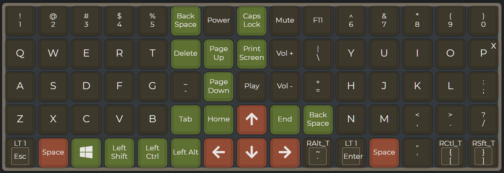
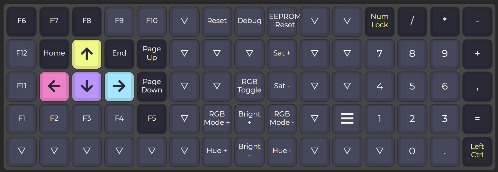
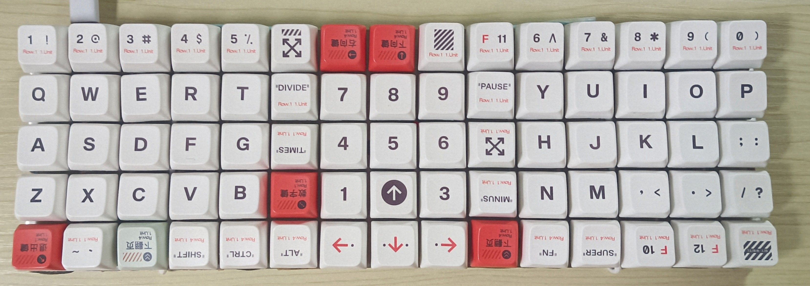

# Someone's XD75 Keyboard Layout

I've been using this keyboard for 5 years now. As a programmer and a Thai who uses the Shift key a lot, this layout is designed to make my life easier. Here's the main idea:

**Thumb Productivity:**
- Using my left thumb to press ```win```, ```shift```, ```ctrl```, and ```alt``` is surprisingly productive.
- You can even press two keys at once with your left thumb.

**Layout Design:**
- I designed this layout to minimize the use of the pinky finger.
- The ```-``` and ```=``` keys are easier to reach on row 2 with the pointer finger, improving speed and comfort.
- I've replaced the numeric 5 keycap with the ```play``` key, giving it a little bump so it's easier to find by touch.

**Key Placement and Usage:**
- The placement of ```F1``` - ```F5``` on row 1 is super convenient.
- I mostly rely on the ```arrow``` keys in layout 1, while layout 0’s ```arrow``` keys rarely get used.
- Grouping the ```home``` and ```end``` keys with the ```arrow``` keys makes text editing much easier, especially when coding.
- I regularly use ```page up``` and ```page down``` in layout 0 for web browsing.

**Miscellaneous:**
- I use the ```Power``` key to turn off my screen (thanks to the OS, not the keyboard itself).
- Now, I find regular keyboards quite uncomfortable to use. 🤣

## Layout Overview

### Layout 0



### Layout 1



### With Keycap (Note: Doesn't Match the Layout)



---

You can customize and build your own version on [QMK Configurator](https://config.qmk.fm/#/xiudi/xd75/LAYOUT_ortho_5x15).

For more details, check out the XD75 on [GitHub](https://github.com/qmk/qmk_firmware/tree/master/keyboards/xiudi/xd75).
